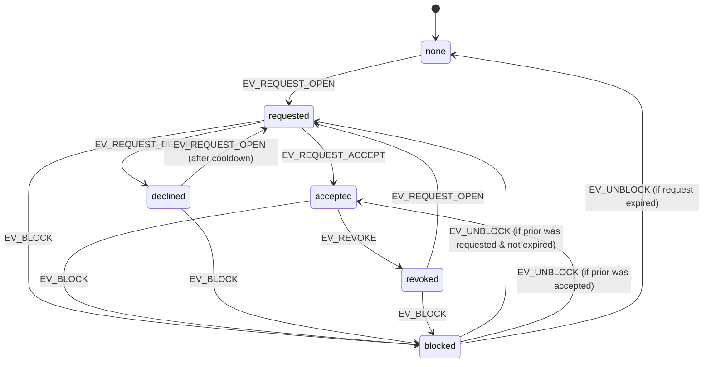
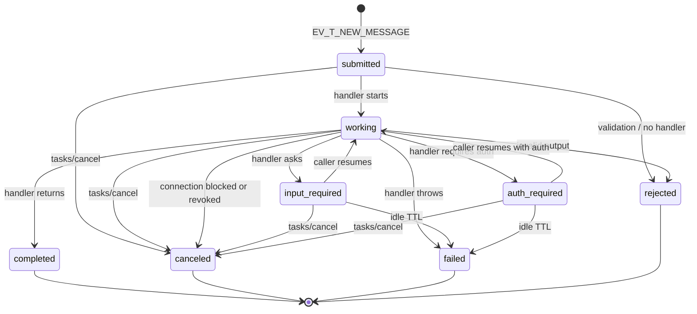

# Agent-to-Agent Communication Architecture (Zynd Personas, v3)

**Status:** Design — source of truth for implementation
**Scope:** The persona-to-persona (agent-to-agent) channel inside `agent-persona`. Human-to-human and human-to-agent flows are out of scope and are not changed.
**Standard:** A2A protocol v0.3 over JSON-RPC 2.0, with the `x-zynd-auth` per-message Ed25519 envelope defined in `zyndai-ts-sdk/src/a2a/` and `zyndai-agent/zyndai_agent/a2a/`.

---

## 1. System Overview

### 1.1 What we are designing

A formal, deterministic, fail-safe protocol that lets one persona's AI agent talk to another persona's AI agent on behalf of two human principals — for example, when Alice tells her agent "set up a 30-minute intro call with Bob next week" and her agent has to coordinate with Bob's agent until either a meeting ticket lands or one side declines.

The replacement covers everything inside the `agent-persona` repo that participates in cross-agent traffic — the webhook ingress, the orchestrator's external mode, the reply path, the connection lifecycle, and the per-thread permission model. It does **not** replace human-typed conversation, the persona registration flow, identity derivation, the heartbeat manager, MCP tool implementations, or the OAuth subsystem.

### 1.2 Goals

1. **Continuous, conversational A2A** — agents must be able to hold multi-turn negotiations across minutes or hours without losing state, without polling, and without race windows where a reply is received but never surfaced.
2. **Deterministic state** — every situation an agent can be in maps to exactly one named state. Every input maps to exactly one transition. There are no implicit timeouts, no implicit retries, no "if it didn't reply within X seconds, hope for the best" code paths.
3. **Cryptographic accountability** — every cross-agent message is Ed25519-signed via `x-zynd-auth`. The receiver always knows which entity is talking and can prove it later. No network peer can forge a sender, replay a message, or send something past its expiry window.
4. **Permission enforcement at three layers** — agent card (advertised), connection (`dm_threads.permissions`), and orchestrator tool allowlist. A foreign agent cannot trigger an action the principal hasn't explicitly granted, even if the LLM hallucinates the call.
5. **Resilience** — transient transport failures must be invisible above the protocol layer. Permanent failures must terminate cleanly with a recorded cause that the principal can see.
6. **Compatibility with the SDKs** — agent-persona becomes a first-class A2A peer that any other agent built on `zyndai-ts-sdk` or `zyndai-agent` can talk to without special-casing.

### 1.3 Key differences from the current implementation

| Concern | Today (legacy) | New design (this doc) |
|---|---|---|
| Wire format | Custom `AgentMessage` JSON POSTed to `/api/persona/webhooks/{user_id}` and `/api/persona/webhooks/{user_id}/sync` | JSON-RPC 2.0 over `POST /a2a/v1` (the spec endpoint) |
| Discovery | Webhook URL stored in DB / on registry card | A2A `/.well-known/agent-card.json` published per persona, signed with the persona's Ed25519 key |
| Authentication | None at message level (relies on registry pre-knowledge) | Per-message Ed25519 `x-zynd-auth` envelope with nonce, expiry, replay cache |
| Conversation identifier | `dm_threads.id` only | `dm_threads.id` IS the A2A `contextId`. Each request inside the connection gets its own A2A `taskId` |
| Reply discovery | Sender polls `dm_messages` for ~60s, gives up if nothing lands | Receiver pushes terminal/interrupted state back via the caller-supplied `pushNotificationConfig`. UI updates via Supabase realtime on the persistence tables |
| Multi-turn flow | Each message is independent; no formal "still working", no formal "I need more info" | Task FSM with `submitted → working → input-required / auth-required → completed / canceled / failed / rejected`. The "I need more info" state is first-class |
| Connection state | Three values: `pending`, `accepted`, `blocked` | Explicit FSM (`none → requested → accepted | declined | blocked → revoked`) with documented transitions |
| Permissions | Four boolean flags consumed only by the orchestrator's allowlist | Same four flags, but enforced at three layers (card advertisement, transport-level rejection, orchestrator allowlist) and revalidated per task |
| State on failure | Silent: caller sees "no reply yet", receiver may have crashed mid-flight | Every task ends in a named terminal state; failures persist a reason string the principal can read |
| Concurrency | Two webhooks (async + sync) coexist; sender can't tell which the receiver will run | One endpoint, two transports negotiated via the agent card (`JSONRPC` for sync, `message/stream` SSE for streaming). Choice belongs to the caller |
| Replay protection | None | LRU nonce cache per `entity_id` with skew-window TTL; replays are rejected with `ZYND_REPLAY_DETECTED` |

---

## 2. Core Concepts

### 2.1 Agent

A persona deployed by a human principal. Identified by `agent_id` (currently `zns:<32 hex>`), backed by an Ed25519 keypair derived from the developer key at `derivation_index`. One agent per principal. The agent is the only thing that participates in A2A traffic; the human never does directly.

### 2.2 Identity

Already in place and not redesigned here. Three properties matter for A2A:

* **`entity_id`** — what the receiver sees on every message. Carried in `x-zynd-auth.entity_id`.
* **`public_key`** — Ed25519 pubkey, base64 (`ed25519:...`). Carried in `x-zynd-auth.public_key`. Hashed to verify against `entity_id`.
* **`developer_proof`** (optional but always sent on first contact) — proves the agent key was HD-derived from a known developer key. Lets the receiver check provenance without an Agent DNS lookup.

### 2.3 Connection

The long-lived relationship between two personas. Stored on `dm_threads`. A connection is the unit of permission: trust, allowed tools, takeover state, and history all hang off it. A connection has its own state machine — see §3.1.

### 2.4 Session (A2A `contextId`)

A connection's stable identifier as far as the protocol is concerned. **`dm_threads.id` IS the `contextId`.** Every cross-agent message on this connection carries the same `contextId`. The `contextId` is what makes a multi-task negotiation feel like one conversation — both sides can correlate "this task is part of the meeting we've been planning" without inspecting message content.

### 2.5 Task (A2A `taskId`)

A single discrete request inside a session. Examples: "ask Bob's agent for availability next week", "propose meeting at T", "ack a counter". A task has its own FSM (§3.2). A task is the unit of:

* state (where in the FSM it is now)
* history (the messages exchanged for this task)
* artifacts (the structured outputs produced by the receiver — e.g. a meeting ticket id)
* timeouts (idle TTL, terminal retention)
* push delivery (one `pushNotificationConfig` per task)

A session typically holds many tasks over its lifetime. Each task is independent — failure of one task never propagates to siblings.

### 2.6 Permissions

Four boolean flags persisted in `dm_threads.permissions` JSONB, owned by the receiver:

* `can_request_meetings` (default ON)
* `can_query_availability` (default OFF)
* `can_view_full_profile` (default OFF)
* `can_post_on_my_behalf` (default OFF)

Permissions live on the connection, not on the task — but each task is gated by them at dispatch time. Changing a permission affects every future task on that connection immediately. In-flight tasks are not retroactively cancelled (they ran with the permissions captured when the task was opened).

### 2.7 Capabilities

Two layers:

* **Agent capabilities** — the persona's `capabilities` array on `persona_agents`. What the agent advertises it can do. Public, on the agent card. Used for discovery only.
* **Tool allowlist** — the actual MCP tools available to the orchestrator on a given task. Computed from `EXTERNAL_DEFAULT_ALLOWED ∪ permission_gates(thread_permissions)`. Computed deterministically per task; never mutated mid-task.

### 2.8 Message types and primitives

The wire types are exactly the A2A spec's. We expose four primitive operations as JSON-RPC methods on `/a2a/v1`:

| Method | Direction | Purpose |
|---|---|---|
| `message/send` | caller → callee | Submit one message. Returns the final Task once it settles (terminal or interrupted). Synchronous from the caller's POV but the callee may take seconds. |
| `message/stream` | caller → callee | Same as send, but the response is an SSE stream of `status-update` and `artifact-update` events until the task is final. |
| `tasks/get` | caller → callee | Read-only Task lookup by id. |
| `tasks/cancel` | caller → callee | Force a task to `canceled`. Only legal on non-terminal tasks. |
| `tasks/resubscribe` | caller → callee | Re-attach an SSE stream to a task already in flight (e.g. after a reconnect). |
| `tasks/pushNotificationConfig/set` | caller → callee | Register or update the URL/token to which the callee will POST terminal-state updates. |
| `tasks/pushNotificationConfig/get` | caller → callee | Read back the current push config. |

A `Message` itself contains an array of typed `Part`s:

* `TextPart` — natural-language content (what the LLM produced).
* `DataPart` — structured payload (e.g. `{ proposed_time: "...", title: "..." }`).
* `FilePart` — inline bytes or remote URI.

This means a single message can carry the LLM's prose and a structured proposal at the same time — no parsing of free text on the receiver side. The orchestrator's tool calls produce `DataPart`s; the orchestrator's natural-language wrap-up produces a `TextPart`.

### 2.9 Push notifications

A receiver-driven async delivery primitive. The caller registers a webhook URL (along with an optional bearer token) with the callee; when the task hits a terminal or interrupted state, the callee POSTs a signed wrapper Message containing a `TaskStatusUpdateEvent` to that URL. agent-persona will expose `POST /api/persona/push/{user_id}` for this. Push delivery never replaces the SSE stream or `tasks/get` — it's a wakeup signal so the caller can fetch and surface the result immediately.

---

## 3. Formal State Machine

There are **two layered FSMs**: the **ConnectionFSM** governs whether two personas can talk at all and on what terms; the **TaskFSM** governs each individual cross-agent request once a connection permits it. The TaskFSM is the A2A spec's lifecycle (we keep it byte-for-byte to stay interoperable). The ConnectionFSM is ours.

### 3.1 ConnectionFSM

#### 3.1.1 States

| State | Meaning | Stored as |
|---|---|---|
| `none` | No `dm_threads` row exists between these two agents. | (absence of row) |
| `requested` | Initiator created the row; receiver hasn't responded yet. No tasks may be opened against this connection. | `dm_threads.status = 'pending'` |
| `accepted` | Both sides agree to communicate. Tasks may be opened. Permissions are honored as configured. | `dm_threads.status = 'accepted'` |
| `declined` | Receiver rejected the request. Connection is dormant; no tasks may be opened. Initiator may not auto-retry. | `dm_threads.status = 'declined'` (new value — see §10.1 schema delta) |
| `blocked` | Receiver actively blocked the initiator. Inbound A2A traffic from this peer is rejected at the transport layer with `ZYND_AUTH_FAILED` reason `untrusted_sender`. | `dm_threads.status = 'blocked'` |
| `revoked` | Either side ended the connection after acceptance. No new tasks may be opened. Existing terminal tasks remain readable for audit. | `dm_threads.status = 'revoked'` (new value) |

Every connection at every moment is in exactly one of the six states. There is no implicit, derived, or "in between" state — `pending` and `accepted` and the rest are mutually exclusive and exhaustive.

#### 3.1.2 Events that drive transitions

| Event | Origin | Notes |
|---|---|---|
| `EV_REQUEST_OPEN` | Initiator | Initiator creates a connection request. |
| `EV_REQUEST_ACCEPT` | Receiver | Receiver accepts via UI. |
| `EV_REQUEST_DECLINE` | Receiver | Receiver declines via UI. |
| `EV_BLOCK` | Receiver | Receiver blocks via UI. Allowed from any non-terminal state. |
| `EV_UNBLOCK` | Receiver | Receiver unblocks via UI. Connection returns to whatever it was before; if it was never accepted, it returns to `requested` only if the original request is still ≤ TTL_REQUEST (30 days). Otherwise it returns to `none`. |
| `EV_REVOKE` | Either side | Either party walks away from an accepted connection. |
| `EV_INBOUND_MESSAGE` | Network | Used to validate transport-level admission, not to change connection state. |

#### 3.1.3 Transition table

Every cell is filled in. `—` means the event is illegal in that state and the system MUST reject it (HTTP 4xx for UI-driven events; transport rejection for network events).

|  | EV_REQUEST_OPEN | EV_REQUEST_ACCEPT | EV_REQUEST_DECLINE | EV_BLOCK | EV_UNBLOCK | EV_REVOKE |
|---|---|---|---|---|---|---|
| **none** | → `requested` | — | — | — | — | — |
| **requested** | — (idempotent: stays `requested`, no row duplication) | → `accepted` | → `declined` | → `blocked` (preserves prior status) | — | — |
| **accepted** | — (idempotent) | — (idempotent) | — | → `blocked` (preserves prior status) | — | → `revoked` |
| **declined** | → `requested` (only if ≥ TTL_DECLINE_COOLDOWN since `declined_at`; else stays `declined`) | — | — | → `blocked` | — | — |
| **blocked** | — (rejected at transport) | — | — | — (idempotent) | → restored prior status (or `none` if expired) | — |
| **revoked** | → `requested` (always allowed; treats the new request as fresh) | — | — | → `blocked` | — | — (idempotent) |

`TTL_REQUEST = 30 days`, `TTL_DECLINE_COOLDOWN = 7 days`. Both are documented invariants, not magic numbers buried in code.

#### 3.1.4 Diagram (Mermaid)



#### 3.1.5 Determinism and absence of deadlock

* For every (state, event) pair the table specifies exactly one outcome (a transition, an idempotent stay, or a rejection). No event is ambiguous.
* The set of events that change state is finite and human-driven (UI buttons or API calls). There is no cycle that lacks a human exit. From any state, the user can always reach `blocked` or `revoked`, both of which terminate the conversation cleanly.
* `requested → accepted` is the only path that opens task-level traffic. There is no shortcut.

### 3.2 TaskFSM

This is the A2A v0.3 spec FSM exactly. We do not redefine it — we adopt it. Documenting it here explicitly so the rest of the system has a single reference.

#### 3.2.1 States

| State | Meaning | Terminal? |
|---|---|---|
| `submitted` | Task entry created, message queued, handler not yet picked up. | No |
| `working` | Handler is running. | No |
| `input-required` | Handler suspended; needs the caller to send another message on this `taskId`. | No (interrupted) |
| `auth-required` | Handler suspended; needs the caller to provide an auth credential before it can continue. | No (interrupted) |
| `completed` | Handler returned a result successfully. Final artifact attached. | Yes |
| `canceled` | Either side called `tasks/cancel`. | Yes |
| `failed` | Handler raised, or the receiver hit a hard error (validation, internal, push delivery exhausted). | Yes |
| `rejected` | Receiver refused at dispatch (no handler registered, payload validation failed, permissions denied). | Yes |

`TERMINAL_STATES = { completed, canceled, failed, rejected }`. `INTERRUPTED_STATES = { input-required, auth-required }`.

#### 3.2.2 Events

| Event | Origin |
|---|---|
| `EV_T_NEW_MESSAGE` | First `message/send` for a new `taskId` |
| `EV_T_RESUME_MESSAGE` | `message/send` for an existing `taskId` currently in an interrupted state |
| `EV_T_HANDLER_STARTS` | Internal, when the handler picks up the message |
| `EV_T_HANDLER_ASKS` | Handler called `task.ask(...)` |
| `EV_T_HANDLER_REQUIRES_AUTH` | Handler called `task.requireAuth(...)` |
| `EV_T_HANDLER_COMPLETES` | Handler returned / called `task.complete(...)` |
| `EV_T_HANDLER_FAILS` | Handler threw or called `task.fail(...)` |
| `EV_T_HANDLER_REJECTS` | Validation failed before dispatch, or no handler |
| `EV_T_CANCEL` | `tasks/cancel` from either side |
| `EV_T_IDLE_TIMEOUT` | Task in interrupted state past `IDLE_TTL_INTERRUPTED` |
| `EV_T_PERMISSION_REVOKED` | Connection moved to `blocked` / `revoked` while task was in flight |

#### 3.2.3 Transition table (per A2A spec, with our additions)

|  | EV_T_NEW_MESSAGE | EV_T_RESUME_MESSAGE | EV_T_HANDLER_STARTS | EV_T_HANDLER_ASKS | EV_T_HANDLER_REQUIRES_AUTH | EV_T_HANDLER_COMPLETES | EV_T_HANDLER_FAILS | EV_T_HANDLER_REJECTS | EV_T_CANCEL | EV_T_IDLE_TIMEOUT | EV_T_PERMISSION_REVOKED |
|---|---|---|---|---|---|---|---|---|---|---|---|
| **(no row)** | → `submitted` | — (rejected: A2A_TASK_NOT_FOUND) | — | — | — | — | — | — | — | — | — |
| **submitted** | — (idempotent) | — (rejected: not interrupted) | → `working` | — | — | — | — | → `rejected` | → `canceled` | — | → `canceled` |
| **working** | — (rejected: task busy) | — (rejected: not interrupted) | — | → `input-required` | → `auth-required` | → `completed` | → `failed` | → `rejected` | → `canceled` | — | → `canceled` |
| **input-required** | — (must reuse `taskId` ⇒ EV_T_RESUME_MESSAGE) | → `working` | — | — | — | — | — | — | → `canceled` | → `failed` (reason: idle) | → `canceled` |
| **auth-required** | — | → `working` | — | — | — | — | — | — | → `canceled` | → `failed` (reason: idle) | → `canceled` |
| **completed** / **canceled** / **failed** / **rejected** | rejects with A2A_TASK_NOT_CANCELABLE on cancel; new messages with the same taskId after retention window land in (no row) and start fresh | — | — | — | — | — | — | — | — | — | — |

#### 3.2.4 Diagram (Mermaid)



#### 3.2.5 Determinism, completeness, freedom from deadlock

* The transition table covers every (state, event) pair. Cells marked `—` are explicit rejection responses, not undefined behavior.
* From any non-terminal state, at least three exit paths to terminal states exist (`EV_T_CANCEL`, `EV_T_IDLE_TIMEOUT` for interrupted states, `EV_T_HANDLER_FAILS` while working). No state can sit forever.
* `submitted` cannot stall on the dispatcher: the server thread that creates a `submitted` row also schedules the handler before returning. If the dispatcher itself crashes, the GC sweeper (§3.2.6) eventually transitions the row to `failed`.
* Cancellation is idempotent on terminal states: receiving `tasks/cancel` for a completed task returns `A2A_TASK_NOT_CANCELABLE`, never silently drops.

#### 3.2.6 Idle GC

The Task Store runs a periodic sweeper:

* Tasks in `INTERRUPTED_STATES` past `IDLE_TTL_INTERRUPTED` (default **1 hour**, configurable per agent) move to `failed` with reason `"Task timed out after Ns of inactivity"`. Any suspended handler is unblocked with an internal abort sentinel.
* Tasks in `TERMINAL_STATES` are retained for `TERMINAL_RETENTION` (default **5 minutes**) so callers can `tasks/get` the result, then deleted from the in-memory store. Persistent task records (see §4.4) keep them indefinitely.

GC events drive transitions through `EV_T_IDLE_TIMEOUT`. They never produce any state not already in §3.2.1.

---

## 4. Message Protocol

### 4.1 Transport

* **Endpoint:** `POST {persona_base_url}/a2a/v1`. Mounted on the existing FastAPI app per persona, dispatched by the same `user_id` path scheme already in use, e.g. `https://your-server.com/api/persona/a2a/{user_id}/v1`. The exact mount path is recorded on each agent card under `url`.
* **Discovery:** `GET {persona_base_url}/.well-known/agent-card.json` (same per-persona scheme). The card carries the canonical `url`, `preferredTransport`, `capabilities`, advertised input/output schemas, and the `x-zynd` extension block (entity_id, public_key, fqan, registry, status, developerProof). The card is signed with the persona's Ed25519 key per A2A's detached-JWS scheme.
* **Transports advertised on the card:** `JSONRPC` as primary; `HTTP+JSON` not advertised (keeps the wire single-shape). Streaming and push notifications are advertised as capabilities.

### 4.2 Envelope

Every cross-agent call is JSON-RPC 2.0:

```
{
  "jsonrpc": "2.0",
  "id": "<uuid>",
  "method": "message/send" | "message/stream" | "tasks/get" | "tasks/cancel" | "tasks/resubscribe" | "tasks/pushNotificationConfig/set" | "tasks/pushNotificationConfig/get",
  "params": { ... }
}
```

The response is either:

```
{ "jsonrpc": "2.0", "id": "<uuid>", "result": <Task | Message | StreamEvent> }
```

or a JSON-RPC error envelope using A2A's documented codes (§4.6).

### 4.3 Message structure

A2A `Message`:

```
{
  "kind": "message",
  "messageId": "<uuid>",
  "role": "user" | "agent",
  "parts": [TextPart | DataPart | FilePart, ...],
  "taskId":    "<task uuid>"     // optional — required to continue/resume
  "contextId": "<dm_threads.id>" // mandatory for cross-agent traffic on this platform
  "metadata": {
    "x-zynd-auth": { v, entity_id, public_key, nonce, issued_at, expires_at, fqan?, developer_proof?, signature }
  }
}
```

Rules the implementation must hold:

1. **`contextId` MUST equal the `dm_threads.id`** on which the connection lives. Without it the receiver can't correlate the task to a permission set or persist the message.
2. **First message of a task omits `taskId`.** The receiver assigns one.
3. **Continuation messages carry the same `taskId`.** Receiving a `taskId` the receiver doesn't have ⇒ JSON-RPC error `A2A_TASK_NOT_FOUND` (-32001).
4. **`messageId` is unique per message** and used for deduplication on the receiver side at the message layer (not the same as nonce, which is per-signature).

### 4.4 Authentication: `x-zynd-auth`

Per-message Ed25519 envelope, defined in `zyndai-ts-sdk/src/a2a/auth.ts` and `zyndai-agent/zyndai_agent/a2a/auth.py`. agent-persona reuses the SDK implementation directly — we do not roll our own crypto.

Verification chain (receiver):

1. Pull `auth = metadata["x-zynd-auth"]`. If absent and `auth_mode = strict`, reject with `ZYND_AUTH_FAILED` reason `missing_auth`. agent-persona uses `strict` for inbound.
2. Check version (`v == 1`).
3. Check expiry window (`now < expires_at`) and skew (`now ≥ issued_at - 60s`).
4. Check nonce uniqueness in the per-sender LRU replay cache.
5. Verify the public key hashes to the prefix in `entity_id` (`zns:` or `zns:svc:`).
6. JCS-canonicalize the message with `signature` blanked, prepend `ZYND-A2A-MSG-v1\n`, Ed25519-verify.
7. (If present) verify `developer_proof` against the agent's public key.

agent-persona signing always includes `developer_proof` on the **first** message of a context, then drops it on subsequent messages to save bytes. The receiver uses this to assert the persona is HD-derived from the same developer key it expects.

### 4.5 Request / response lifecycle (the canonical path)

```
Caller agent (Alice's persona)                       Callee agent (Bob's persona)
──────────────────────────────                       ───────────────────────────
sign Message m1 (role=user, contextId=T)
POST /a2a/v1                                         verify x-zynd-auth(m1)
  method = message/send                              check connection FSM (§5.4)
  params.message = m1                                allocate taskId, contextId
  params.configuration.pushNotificationConfig =      task: submitted
    { url: PUSH_URL, token: TKN }                    register pushConfig

                                                     dispatch handler thread
                                                     task: working
                                                     run orchestrator (external mode)
                                                     ... (may take seconds) ...
                                                     handler returns Result
                                                     task: completed, append artifact

←──── JSON-RPC result: Task (state=completed)
      (taken from in-memory store; identical to what tasks/get would return)

                                                     deliver_push_if_configured(taskId)
                                                     POST PUSH_URL { wrapper: signed Msg
                                                       + DataPart{ status-update event }}
←──── push delivery (out-of-band)

(caller updates UI / persists artifact)
```

Two delivery channels for the same final state — the synchronous JSON-RPC reply AND the async push notification. **Both paths converge on the same Task; reading either is sufficient.** The push exists for the case where the caller's process has died or never blocked (`blocking=false`) on the original call.

### 4.6 Async handling (continuous conversation)

The protocol supports continuous, multi-turn conversation **without** dropping out of the task lifecycle. Two patterns:

**Pattern A — interrupted-state loopback (within one task).** Bob's handler calls `task.ask("which afternoon works for you?")`. The task transitions `working → input-required`, the JSON-RPC `result` returns to Alice. Alice's orchestrator inspects the Task, sees `state=input-required`, picks the question off `status.message.parts`, formulates a new message reusing the **same taskId**, and POSTs again. Bob's handler resumes from where it paused (the SDK's `task_store.suspend_until_next_message` already implements this). Loops until Bob's handler completes.

**Pattern B — task chain (across tasks).** Some negotiations span multiple tasks under the same `contextId`. Example: task #1 = "ask availability", completes. Alice's orchestrator decides on a slot. Task #2 = "propose meeting at T". Each task gets its own taskId; both share the contextId. The receiver's `agent_tasks` table (the meeting ticket) references the contextId, not any single taskId, so it survives task boundaries.

Pattern A is the default for back-and-forth. Pattern B is used when the work changes shape (a question vs. a proposal vs. an ack).

### 4.7 JSON-RPC error codes used

| Code | Name | When |
|---|---|---|
| -32700 | RPC_PARSE_ERROR | Body wasn't valid JSON |
| -32600 | RPC_INVALID_REQUEST | Not JSON-RPC 2.0 |
| -32601 | RPC_METHOD_NOT_FOUND | Unknown method |
| -32602 | RPC_INVALID_PARAMS | Validation failed on params |
| -32603 | RPC_INTERNAL_ERROR | Caught exception in dispatch |
| -32001 | A2A_TASK_NOT_FOUND | Unknown taskId |
| -32002 | A2A_TASK_NOT_CANCELABLE | Cancel attempted on terminal task |
| -32003 | A2A_PUSH_NOTIFICATION_NOT_SUPPORTED | (Reserved; not used by agent-persona) |
| -32004 | A2A_UNSUPPORTED_OPERATION | Connection not `accepted` so this method is not available |
| -32005 | A2A_CONTENT_TYPE_NOT_SUPPORTED | Future use |
| -32006 | A2A_INVALID_AGENT_RESPONSE | Output failed schema validation |
| -32100 | ZYND_AUTH_FAILED | Generic signature/identity failure |
| -32101 | ZYND_REPLAY_DETECTED | Nonce already seen in window |
| -32102 | ZYND_AUTH_EXPIRED | Outside the issued/expires window |

Only these codes are ever produced by the new transport. Anything else is a bug.

---

## 5. Connection Lifecycle

### 5.1 Creating a connection

Initiator goes from `none → requested`. The implementation already does this via `request_connection` (the MCP tool) and the UI's "start chat" path. New protocol invariants on top:

1. The initiator's first cross-agent message after creating the row MUST be the connection-handshake message (a `DataPart` with `kind: "zynd.connection.request"` and the initiator's introduction text). This is sent via `message/send` and creates the receiver's first task on this connection.
2. The receiver's A2A server, on every inbound message, checks the ConnectionFSM (§5.4) before dispatching. A handshake message on a `requested` connection is **always** dispatched even though the connection isn't `accepted` yet — this is the ONE message exception that lets the receiver see the request content.
3. Until the receiver moves the connection to `accepted` via UI, the receiver's agent does NOT auto-reply. The initiator gets a Task with `state=submitted` and a status message like "awaiting human approval" — they can poll `tasks/get` or wait for the push notification when the human acts.

### 5.2 Maintaining a session

A session (contextId) is alive as long as the connection is `accepted`. Maintenance is implicit — there is no keepalive. The persistence layer is the source of truth, and the protocol carries no session state of its own outside of `taskId` continuations.

### 5.3 Pause / resume — per-side mode (human takeover)

Each participant independently flips their side of the connection between `agent` (AI handles) and `human` (human will reply manually). This is **NOT** a TaskFSM state — it is a connection-level toggle that affects how the receiver dispatches inbound messages.

Behavior:

* Side `mode = agent` (default): inbound message dispatches to the orchestrator handler as normal.
* Side `mode = human`: the receiver's A2A server acks the message at the transport level (the task transitions `submitted → working → completed` with an artifact `DataPart { kind: "zynd.takeover.queued" }` and a TextPart explaining "the principal will respond personally"). No orchestrator runs. The human types into the human channel of the UI; that lives outside this protocol.

The caller can detect human takeover by inspecting the artifact's data kind. They typically downgrade their UI to "waiting for human" and stop sending agent-style follow-ups.

Switching modes mid-session has no effect on in-flight tasks (those have already dispatched). Future tasks see the new mode.

### 5.4 Pre-dispatch admission gate

Every inbound `message/send` and `message/stream` runs the **admission gate** before allocating a task:

```
1. Verify x-zynd-auth (§4.4)                       → fail ⇒ JSON-RPC error
2. Look up dm_threads by contextId                  → not found ⇒ check sender_entity_id;
                                                                  if unknown sender, see §5.1 handshake rule
3. ConnectionFSM check:
     state == blocked          → reject (-32004 + reason "blocked_by_receiver")
     state == declined         → reject (-32004 + reason "request_declined")
     state == revoked          → reject (-32004 + reason "connection_revoked")
     state == requested        → ONLY allow if message is a handshake DataPart
     state == accepted         → allow
4. Enforce expires_at on x-zynd-auth (already done in step 1, repeat-defensive here)
5. Compute permission snapshot from dm_threads.permissions; freeze on the task
6. Allocate taskId, transition submitted → working, dispatch handler
```

This gate is the single chokepoint where every inbound message is reasoned about. There is no other path into the orchestrator from the network.

### 5.5 Termination

Two termination paths:

* **Soft (`revoked`):** either side decides to end the relationship without animosity. Permissions are zeroed, the connection FSM sits at `revoked`, all in-flight tasks transition `→ canceled` via `EV_T_PERMISSION_REVOKED`. New `message/send` from the other side is rejected at the admission gate.
* **Hard (`blocked`):** receiver actively rejects the peer. Same task cleanup as `revoked`. Additionally, every subsequent inbound message from this `entity_id` is rejected at step 3 of the admission gate without dispatching, even if the connection is later un-blocked.

Termination is not directly exposed as an A2A method — the protocol is for tasks, not connection management. Termination is a UI action that mutates `dm_threads` and triggers the cleanup as a side effect.

---

## 6. Error Handling and Reliability

The exhaustiveness rule: **every code path that can fail has a named outcome state**. The matrix below enumerates them. There are no "best effort" branches.

### 6.1 Failure matrix

| # | Failure | Where it surfaces | Outcome state | User-visible behavior |
|---|---|---|---|---|
| 1 | Network unreachable on outbound `message/send` | Caller | n/a (caller-side) | Caller surfaces a `delivery_failed` Task (synthetic `failed`) with reason "network unreachable: <err>". Retry policy applies. |
| 2 | TLS / handshake error | Caller | n/a | Same as #1; reason "tls_error". No retry (could be a permanent misconfiguration on receiver side). |
| 3 | Non-200 HTTP response with no JSON-RPC envelope | Caller | n/a | Caller raises `A2AError` with `code=RPC_INTERNAL_ERROR`, body excerpt for debugging. Retry policy applies. |
| 4 | JSON-RPC error envelope returned (any `-32xxx`) | Caller | n/a | Caller surfaces the error code+message verbatim. No retry on auth/perm errors; retry on `RPC_INTERNAL_ERROR`. |
| 5 | `x-zynd-auth` missing / bad signature / replay / expired | Receiver | (no task created) | JSON-RPC error -32100/-32101/-32102 to caller. No persistence side effect. |
| 6 | Connection in `blocked` / `declined` / `revoked` | Receiver | (no task created) | JSON-RPC error -32004 with reason. Caller's UI marks the connection unusable. |
| 7 | Connection in `requested` and message is not a handshake | Receiver | (no task created) | JSON-RPC error -32004 reason `"awaiting_acceptance"`. Caller's UI surfaces "still waiting for accept". |
| 8 | Unknown `taskId` | Receiver | (no task created) | JSON-RPC error A2A_TASK_NOT_FOUND. Caller's orchestrator drops the in-memory taskId and starts a fresh task. |
| 9 | Payload validation failure | Receiver | task `rejected` | Status message carries reason. |
| 10 | No handler registered (impossible in production but defensive) | Receiver | task `rejected` | Status message: "no handler registered". Operational alert. |
| 11 | Handler raised an unhandled exception | Receiver | task `failed` | Status message has the exception string. Push delivered. |
| 12 | Handler intentionally `task.fail(reason)` | Receiver | task `failed` | Reason as written. |
| 13 | Handler `task.requireAuth(scheme)` and caller doesn't supply | Receiver | task `failed` after IDLE_TTL_INTERRUPTED | Reason: "auth-required idle timeout". |
| 14 | Caller blocks waiting for resume but caller's process dies | Receiver | task `failed` after IDLE_TTL_INTERRUPTED | Reason: "input-required idle timeout". Push notification fires if push config registered. |
| 15 | `tasks/cancel` while `working` | Receiver | task `canceled` | If the handler is in a tight CPU loop the cancel is observed at the next yield; if the handler is awaiting external IO, the cancel takes effect when IO resolves. We do not preempt running threads. |
| 16 | `tasks/cancel` on terminal task | Receiver | (no change) | -32002 A2A_TASK_NOT_CANCELABLE. |
| 17 | Connection moved to blocked/revoked while task in flight | Receiver | task `canceled` (EV_T_PERMISSION_REVOKED) | Status reason mentions which connection event triggered. |
| 18 | Push delivery POST fails (network, 5xx) | Receiver | task remains in its terminal state | Receiver retries push 3× with exponential backoff (1s, 4s, 16s). After exhaustion: log warning, do NOT change task state. The next `tasks/get` from the caller still returns the truthful state. |
| 19 | Push delivery POST returns non-2xx 4xx (caller rejects) | Receiver | task remains terminal, push abandoned | Same: caller can still `tasks/get`. |
| 20 | SSE stream client disconnect mid-task | Receiver | task continues to its natural end | When the handler completes, the unsubscribe was already triggered on disconnect; results are still in the task store. Caller can `tasks/resubscribe`. |
| 21 | Inbound body too large | Receiver | (no task created) | HTTP 413, no JSON-RPC envelope (this is a transport-layer failure before parse). |
| 22 | Replay cache memory pressure | Receiver | n/a | Per-sender bucket capped at 4096 entries; oldest evicted. May cause an "old replay accepted" if a sender exceeds 4096 messages within the skew window — acceptable since each message is also expiry-bounded. |

### 6.2 Retry logic

Retries are **caller-side only**. The receiver never retries handler dispatch. Handler-internal retries (e.g. an MCP tool retrying an OAuth refresh) are the tool's responsibility, not the protocol's.

Caller retry rules — applied by the orchestrator when wrapping `message/send`:

| Outcome | Retry? | Backoff |
|---|---|---|
| Network unreachable / TLS / 5xx without JSON-RPC | yes, max **3** attempts | 1s, 4s, 16s |
| `RPC_INTERNAL_ERROR` (-32603) | yes, max **2** attempts | 4s, 16s |
| `RPC_INVALID_PARAMS` (-32602) | no | — |
| `RPC_METHOD_NOT_FOUND` (-32601) | no | — |
| `A2A_TASK_NOT_FOUND` (-32001) | no (start fresh task) | — |
| `A2A_UNSUPPORTED_OPERATION` (-32004) | no (connection state, not transient) | — |
| `ZYND_AUTH_FAILED` / `_EXPIRED` / `_REPLAY_DETECTED` | no (re-sign with fresh nonce/timestamp ⇒ not a retry, a new send; max 1 fresh send) | — |
| 4xx other than the above | no | — |

Retry-on-success bookkeeping: each retry uses a **fresh `messageId`** and **fresh `nonce`/`signature`**. The receiver dedupes on `messageId` if it's seen recently for this contextId — see §6.3 invariant 3.

### 6.3 Timeouts

* **Caller-side outbound HTTP timeout:** 5 minutes for `message/send`; 30 minutes for `message/stream`; 30 seconds for `tasks/get|cancel|pushNotificationConfig/*`. These are per-call, not per-task.
* **Idle TTL on interrupted tasks:** 1 hour (configurable per agent). Hits §6.1 #13/#14.
* **Terminal retention:** 5 minutes in-memory, indefinite in `a2a_tasks` persistence.
* **Handshake (request) TTL:** 30 days. After this a `requested` connection auto-transitions to `revoked`.
* **`x-zynd-auth` validity window:** 60 seconds default (configurable down to 10s for high-security flows, up to 5 min for low-network-quality flows).
* **Replay cache window:** matches the validity window; when a nonce expires it's swept.

### 6.4 Recovery paths

For every failure outcome, there is a recorded route back to a healthy state:

* **Crashed receiver process while task `working`:** on restart, the in-memory task store is empty. The persistent `a2a_tasks` row is in `working`. A reconciliation pass on startup transitions all `a2a_tasks.state == 'working'` rows to `failed` reason `"server_restart"`. Push notifications fire.
* **Crashed caller process while waiting:** caller had registered a push config. On the next cold start the orchestrator queries `tasks/get` for any tasks it had marked "in flight" in its own DB and surfaces results that landed during downtime.
* **Persistent push delivery failure:** task is terminal but caller never knew. `tasks/get` still works. Next time the caller's orchestrator opens a task on this connection, it queries pending tasks first and clears the backlog.
* **Connection blocked with in-flight tasks on the caller side:** caller observes `A2A_UNSUPPORTED_OPERATION` reason `blocked` on the next send; existing tasks transition `canceled` via the receiver-side EV_T_PERMISSION_REVOKED.

---

## 7. Permissions and Capability Model

### 7.1 Three layers of enforcement

| Layer | What it does | Where it runs | Failure mode |
|---|---|---|---|
| Card advertisement | Lists what the persona's agent CAN do (tags, skills, x-zynd capabilities) | `/.well-known/agent-card.json` | A caller asking for something not advertised gets a polite refusal but is not protocol-blocked — the card is informational, not authoritative for permission. |
| Connection permissions | Per-thread booleans (§2.6) | Admission gate (§5.4) freezes them on the task; orchestrator reads them inside `external_permissions` | A foreign agent sending a message that requires a permission the connection lacks: the orchestrator builds an allowlist that excludes the gated tool; if the LLM still calls it, it's hard-blocked. |
| Tool allowlist | Set of MCP tool names the orchestrator will dispatch in external mode | Orchestrator pre-flight check before MCP `_call` | Tool call rejected; result fed back to the LLM as `{ error: "permission_denied", message: "..." }` so the LLM can produce a graceful refusal. |

The three layers are independent. A capability appearing on the card does not grant connection permission. A connection permission does not bypass the orchestrator's hard-block (defense in depth: even if a misconfiguration leaks the permission flag, the allowlist is the final gate).

### 7.2 Permission semantics

* **Connection-scoped, not task-scoped.** Permissions live on `dm_threads`, not on tasks.
* **Captured on dispatch.** The admission gate reads the current permission snapshot when allocating the task and pins it on the task record. A permission change made after dispatch does NOT retroactively affect the in-flight task.
* **Default conservative.** New connections start with only `can_request_meetings = true`. The receiver opts the foreign side into anything else explicitly.
* **Receiver-owned.** Only the receiver can set `dm_threads.permissions` via `PATCH /api/persona/threads/{thread_id}/permissions`. The initiator never gets to set their own permissions on this connection.
* **Symmetrical for negotiation.** Each side has its own permission snapshot — Alice's permissions on the connection govern what Bob's agent can ask Alice's agent to do, and vice versa.

### 7.3 Where permissions enter the architecture

* **§5.4 admission gate** — looks them up; included on the task record so it can't drift.
* **§3.1 ConnectionFSM** — permissions are inherited across `requested → accepted` (defaults). They survive `accepted ↔ blocked ↔ accepted` round trips. They are zeroed on `revoked`.
* **§8.2 MCP integration** — the allowlist is computed from these and the LLM only sees allowed tools.
* **Agent card extension** — the card MAY include an `x-zynd.permissions.required_for_action` map listing which permission a foreign agent would need to invoke each advertised skill. This is informational, not enforced.

### 7.4 Capability advertisement (separate from permissions)

`persona_agents.capabilities` is converted into the agent card's `skills[]` array on every card rebuild. This is what shows up to other agents during discovery. The capability list never grants anything — it just makes the persona findable. The receiver still enforces permissions per connection.

---

## 8. MCP Integration

### 8.1 When MCP is invoked

MCP tools (the existing ContextAware registry) are invoked **only inside the orchestrator's handler**, which runs after the admission gate has accepted the inbound message. There is no path from the network to MCP that bypasses the gate.

### 8.2 Permission checks before invocation

For each tool call the LLM emits in external mode:

```
1. Look up the per-task pinned external_permissions
2. Compute allowlist = EXTERNAL_DEFAULT_ALLOWED ∪ ⋃{ permission_gates[k] | external_permissions[k] }
3. If tool_name ∉ allowlist:
       inject { error: "permission_denied", message: "..." } into the conversation
       skip MCP._call entirely
4. Else:
       execute MCP._call(tool_name, args)
       wrap result back into the conversation
```

This is already implemented in the current orchestrator (§4.2 of `agent-persona/architecture.md`) and is preserved. The change in this design is that the permission set is **captured on the task** at dispatch time, not pulled fresh on every tool call. Pulling fresh would race with permission edits and produce inconsistent task histories.

Note also: the `propose_meeting` direction-fix in the existing orchestrator (foreign agent triggers a proposal on behalf of its principal) is preserved — it's a property of the `propose_meeting` tool, not of the protocol.

### 8.3 MCP failure handling within the state system

| MCP outcome | TaskFSM impact |
|---|---|
| Tool returns `{ error: "..." }` | No FSM impact. Result fed to LLM; LLM either retries with different args, or wraps up the task with `working → completed` and the error explained in the artifact text. |
| Tool raises a Python exception | No FSM impact. Caught in orchestrator, fed back to LLM as `{ error: "Tool execution failed: ..." }`. |
| Tool succeeds | No FSM impact during execution; eventual `working → completed` driven by the LLM finishing its loop. |
| Tool times out (network upstream) | No FSM impact; tool layer's timeout returns an error dict. Orchestrator does NOT cause the task to fail — that's the LLM's call. |
| The orchestrator's overall iteration cap is hit (max_iterations=6) | Task `working → completed` with whatever text the LLM had; or `working → failed` if the LLM never produced a final reply. The choice is determined by the orchestrator's existing logic. |

Critically: a misbehaving MCP tool can never land the task in a state outside the TaskFSM. Every tool error eventually surfaces as a `completed` artifact (with the error described), a `failed` task (with reason), or a `canceled` task (if the caller cancels mid-execution).

### 8.4 Tool calls that produce A2A traffic of their own

`message_zynd_agent` (the orchestrator's outbound networking tool) is itself an A2A caller. When invoked inside an external-mode handler, the outbound A2A `message/send` it produces opens a new task **on a different connection** (the destination). That task lives in its own TaskFSM, with its own `contextId` (the other connection's `dm_threads.id`). There is no cross-talk between the two TaskFSMs — the outer task waits on the tool result like any other tool call; the inner task settles independently.

This compositional property is what makes networking-by-proxy work cleanly: Alice's agent can be in the middle of a task with Bob, where the tool that helps complete that task is itself a task with Carol. All three tasks are independent, all governed by the same FSM, all auditable.

---

## 9. Invariants and Guarantees

### 9.1 Identity invariants

* **I-1.** Every cross-agent message that the receiver dispatches has `auth.signed = true`. (Strict mode; missing or invalid auth ⇒ rejected at gate.)
* **I-2.** `entity_id` matches the SHA-256 prefix of `public_key`. The receiver verifies this before any other check.
* **I-3.** `developer_proof`, when present, verifies against the agent's pubkey. The receiver MAY require it on the first message of a context.

### 9.2 Connection invariants

* **C-1.** `dm_threads.id` is the `contextId` for every cross-agent message on this connection. There is no other place a contextId comes from.
* **C-2.** The ConnectionFSM is in exactly one of six states at any time; transitions follow §3.1.3 strictly.
* **C-3.** Permission writes are only accepted from the receiver's side via the documented endpoint. Service role bypasses are reserved for backend reconciliation only.

### 9.3 Task invariants

* **T-1.** Every task is in exactly one TaskFSM state at any time. Transitions follow §3.2.3 strictly.
* **T-2.** A task always reaches a terminal state. Either via handler completion, timeout, cancel, or connection-level revocation. There is no eternal task.
* **T-3.** A task's permission snapshot is fixed at dispatch and is not mutated for the lifetime of the task.
* **T-4.** A task's `contextId` is fixed at creation and never mutates.

### 9.4 Message invariants

* **M-1. No silent drops.** Every accepted inbound message is persisted (in `a2a_tasks.history` AND, for human-readable reflection, in `dm_messages` channel='agent') before the handler is dispatched. If the handler crashes, the message is still on record.
* **M-2. No spurious duplicates from the receiver.** The receiver dedupes on `(contextId, messageId)` within a 5-minute window. A retried send with the same `messageId` is a no-op (returns the existing task state).
* **M-3. Replay protection.** Per-sender LRU cache rejects any message whose nonce is already seen within its expiry window.
* **M-4. Strict ordering within a task.** Handler-side: messages on the same `taskId` are processed in the order they were verified by the gate. The gate is single-threaded per task (the suspended-handler resume model in `task_store` enforces this). Across tasks there is no ordering guarantee.
* **M-5. Signed reflectors.** Every outbound message the receiver sends back (status updates, ask questions, completion artifacts, push notifications) is itself signed by the receiver's keypair. The caller can verify the response exactly the same way.

### 9.5 Reliability invariants

* **R-1. At-least-once handler dispatch.** A successfully verified message on an `accepted` connection causes the handler to run at least once (zero-or-more in failure recovery: a crash during dispatch is reconciled to `failed` on restart, and if the caller retries with the same messageId, M-2 dedupes it).
* **R-2. At-most-once observable side effect.** A handler that performs an externally-visible action (sending an email, writing to LinkedIn) MUST do so via an MCP tool that itself implements idempotency (e.g. by hashing the payload). The protocol guarantees the handler runs at-least-once; the tool guarantees the side effect happens at-most-once.
* **R-3. Push delivery is best-effort with bounded retries.** Push notification is a UX optimization; truth lives in the task record reachable via `tasks/get`.
* **R-4. Bounded memory.** Per-sender replay cache caps at 4096 entries. Per-process task store sweeps interrupted-state tasks past TTL and terminal-state tasks past retention. No unbounded growth.

### 9.6 Predictability and fail-safety

* **P-1. Determinism.** For every pair (state, event) on both FSMs there is exactly one outcome documented in the transition tables. There are no implementation-defined behaviors.
* **P-2. Conservative defaults.** Every default chosen in this design fails toward refusal rather than action: connections start `requested`, permissions start mostly `false`, auth_mode starts `strict`, mode starts `agent`. A misconfigured persona is unreachable, not over-permissive.
* **P-3. Cryptographic accountability.** Every accepted message and every emitted reply is signed with an Ed25519 key tied to a registered persona. There is no anonymous traffic on this protocol after this redesign.
* **P-4. Schema-bounded payloads.** Every task's input is validated against the persona's `payloadModel` (Zod / Pydantic) before the handler sees it. Validation failure ⇒ `rejected`, never silent acceptance of garbage.

---

## 10. Implementation Notes (non-binding, for the next stage)

This section is informational — it sketches the changes needed to realize the architecture. It does NOT specify code; the code is for the implementation step. It is included so reviewers can sanity-check that the design is realizable.

### 10.1 Schema deltas

* `dm_threads.status` — add values `declined` and `revoked` to the existing CHECK constraint.
* New table `a2a_tasks` — keyed by `task_id` UUID. Columns: `task_id`, `context_id` (= `dm_threads.id`), `state`, `permission_snapshot` JSONB, `created_at`, `updated_at`, `terminal_at`, `idle_until`, `push_url`, `push_token`, `history` JSONB, `artifacts` JSONB, `last_message_id`, `idle_ttl_ms`, `failure_reason`. Indexed on `(context_id, updated_at desc)`.
* `persona_agents` — add `card_path` and `a2a_path` columns documenting the per-persona endpoints (defaulting to `/api/persona/{user_id}/.well-known/agent-card.json` and `/api/persona/{user_id}/a2a/v1` respectively).

### 10.2 Module deltas inside agent-persona

* `agent/agent_message.py` — retired. Outbound construction goes through the SDK's `to_a2a_message` + `sign_message`.
* `api/persona.py` — `/webhooks/{user_id}` and `/webhooks/{user_id}/sync` removed. New blueprint mounting the SDK's `A2AServer` per persona at `/api/persona/{user_id}/a2a/v1` and `/api/persona/{user_id}/.well-known/agent-card.json`. Single `handler` registered with the server is the existing `handle_user_message` entry, wrapped to translate A2A `HandlerInput → handle_user_message` args and `handle_user_message return → task.complete(...)`.
* `api/persona.py` — new `POST /api/persona/push/{user_id}` endpoint that receives push wrappers from peers and updates the local task records (the caller side).
* `mcp/tools/zynd_network.py::message_zynd_agent` — rewritten to use the SDK's `A2AClient` rather than raw `requests.post + DB poll`. Reply discovery is the JSON-RPC result of `client.sync(...)`; multi-turn uses `client.stream(...)` or repeated `client.sync(taskId=...)`.
* `agent/orchestrator.py` — unchanged in shape; it gains the per-task `permission_snapshot` parameter (replacing the on-the-fly permission read) and learns to recognize `Task.status.state == "input-required"` as a "the other side asked something — show it to my principal" signal.

### 10.3 Out of scope explicitly

* The Ed25519 identity layer, HD derivation, heartbeat manager, registry registration, and developer-proof generation are unchanged. They already work and are not part of the A2A redesign.
* The human channel (`channel='human'` rows on `dm_messages`) is unchanged. People still type to people the way they always did.
* The MCP tool internals are unchanged. Only the layer above MCP changes.

---

## 11. Open questions deferred to implementation

These are conscious deferrals — they don't block the design, but they need answers when code lands.

1. **Per-persona vs shared task store.** All personas live in one FastAPI process; do they share one `TaskStore` or get one each? Memory cost is trivial either way; the question is observability. Recommendation: one per persona, keyed by `user_id`, so debug logs cleanly attribute task IDs.
2. **Public endpoint shape for the agent card.** The SDKs default to `/.well-known/agent-card.json` at the persona's base URL. We must decide whether to expose `https://server/.well-known/agent-card.json` (one persona per host, won't work multi-tenant) or `https://server/api/persona/{user_id}/.well-known/agent-card.json` (multi-tenant, non-spec path). Recommendation: the second, and the registry stores the explicit URL in the entity_url so external peers don't depend on the default path.
3. **Card signature key rotation.** Out of scope for v3 but the schema should anticipate it: agent cards already support multiple `signatures[]` entries.
4. **Backpressure on push delivery.** If a peer is slow to ack push POSTs, we shouldn't queue arbitrarily many of them. Cap per-peer in-flight pushes at 16; drop oldest with a logged warning.

---

## 12. Glossary

| Term | Meaning |
|---|---|
| A2A | Agent-to-Agent protocol, https://a2a-protocol.org/v0.3.0/specification/ |
| Agent card | The signed JSON document at `/.well-known/agent-card.json` describing a persona's capabilities, endpoints, and identity. |
| Connection | The long-lived relationship between two personas, stored on `dm_threads`. |
| Context (`contextId`) | A2A's name for the conversation; we equate it with `dm_threads.id`. |
| Handler | The function the SDK's A2AServer calls to process an inbound message. agent-persona's handler delegates to the existing orchestrator. |
| Initiator | The side that opened the connection. |
| JCS | RFC 8785 JSON Canonicalization Scheme — the deterministic JSON serialization used for signing. |
| Orchestrator | The existing LLM-driven conversation engine in `agent/orchestrator.py`. |
| Persona | A user-deployed AI agent on the Zynd Network. One per principal. |
| Principal | The human who owns the persona. |
| Push notification | A receiver-initiated signed POST that wakes up the caller when a task reaches a terminal state. |
| Receiver | The side that owns the inbox a message is being delivered to. |
| Session | Synonym for context (in conversational terms). |
| Task (`taskId`) | A single discrete request inside a context. |
| `x-zynd-auth` | The per-message Ed25519 envelope embedded in `Message.metadata`. |